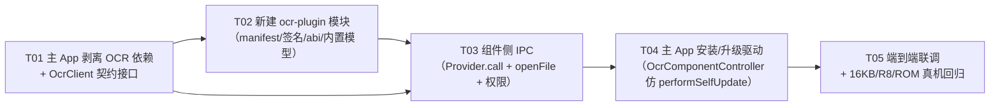
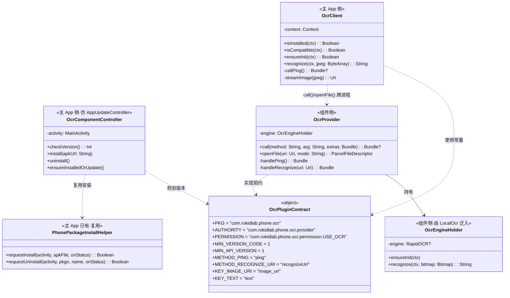
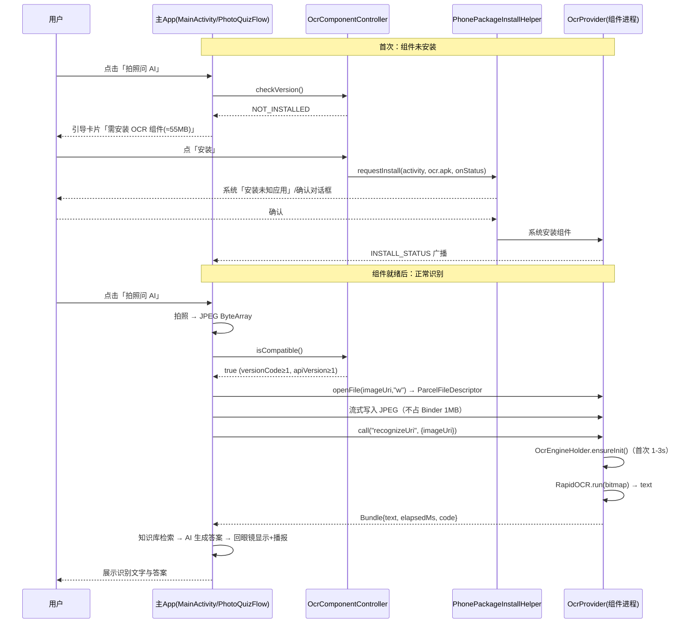

# 辅助 APK 集成形态设计（T2：OCR 全栈下沉）

> 设计对象：`D:\rokidapp\cxrl\RokidLab`（Kotlin/Compose，targetSdk 34，minSdk 29）
> 上游依据：`docs/MODULE_STRIPPING_2026-09-14.md`（T2 方案：把 OCR 全栈 55.4 MB 下沉到第二个 APK）
> 设计日期：2026-09-14 ｜ 性质：**只读研究 + 设计输出，未改动任何源码 / 构建脚本 / 资源**
> 设计人：软件开发团队 · 架构师（高见远）

---

## 0. 结论速览（TL;DR）

| # | 问题 | 结论 |
|---|---|---|
| 1 | 用户问：装第二个 APK 是「新软件」还是「补丁」？ | **是「并列的独立组件」（sibling / companion app），不是补丁。** Android 平台**不存在**把代码增量「打入已装 App」的机制；唯一可行形态是两个独立 package 通过 IPC 协作。详见 §1 |
| 2 | 能不能用 Split APK / App Bundle / dynamic feature 做成「补丁」？ | **不能。** 本项目 APK 直发 Gitee，不走 AAB / 不走 Google Play；split 必须与 base **同包名、同签名、同 versionCode 原子安装**，**无法向已装 App 追加**；dynamic feature 的下载通道是 Google Play，直发场景无此通道。详见 §1.2 |
| 3 | sharedUserId 能合并吗？覆盖安装算补丁吗？ | sharedUserId **已废弃且从不合并代码**（只共享 UID/数据目录）；覆盖安装（同 applicationId 升级）是**同包「原位更新」**，是 Android 最接近「补丁」的形态，但**无法把第二个包折进第一个包**。详见 §1.3 / §1.4 |
| 4 | 落地方案 | 新建 `ocr-plugin` 应用模块（`applicationId com.rokidlab.phone.ocr`、**同一 keystore 签名**、无桌面图标、独立进程），主 App 经 **ContentProvider.call() + openFile()** 调用；安装/升级复用**已存在的手机端安装管道**（重大发现，详见 §5） |

> **两项对既有勘察的更正**（利好，直接简化实现）：
> 1. **主 App 已有 `ContentProvider`**：`phone-app/src/main/AndroidManifest.xml:95-103` 声明了 `androidx.core.content.FileProvider`，`file_paths.xml` 已覆盖 `cache-path`/`files-path`/`external-path`。原文「无任何 ContentProvider」不成立。
> 2. **主 App 已有「下载 APK → 装到手机」的完整管道**：`mirror/PhonePackageInstallHelper.kt`（PackageInstaller 会话）+ `glasses/PhoneInstallResultReceiver.kt`（结果广播）+ `feature/AppUpdateController.kt:89-137` `performSelfUpdate()`（下载 → 安装）。**OCR 组件的安装与主 App 自助更新是同一形态**，可直接照搬。详见 §5。

---

## Part A. 集成形态设计

### 1. 正面回答用户的问题：是「联合使用的第二个软件」还是「补丁」？

#### 1.1 一句话结论

> **安装第二个 APK 之后，它和主 App 是「并列关系的两个软件」**——各自有独立的 package、独立的进程、独立的 `nativeLibraryDir`、独立的数据目录、在「设置 → 应用」里各自独立列出；它们之间通过 Android IPC 协作。
> **它不是「补丁打入主 App」**——Android 没有这种机制。

类比：就像 **Android System WebView** 和某个用到 WebView 的 App——用户在「设置→应用」里能看到 WebView 这个独立组件，但它**没有桌面图标**，只在被主 App 调用时工作。这正是我们要对齐的心智模型。

#### 1.2 为什么不能做成「补丁」——逐条封死

**（a）Android 没有「APK 补丁/增量打入已装 App」的机制。**

| 机制 | 是否存在 | 说明 |
|---|---|---|
| OS 层「下载差分包 → 合并进已装 APK」 | ❌ **不存在** | 没有任何公开 API 允许应用把自己或他人的已安装代码做增量修改。Play 内部的 delta/incremental 交付是 Play 私有、对应用不可见 |
| APK Signature Scheme v4 / incremental install | ❌ **不可用** | 是系统 + Play 侧特性，依赖 ADB/Play，直发场景用不了 |
| `.so` 下载后 `dlopen` | ❌ **被 W^X 封死** | 上游文档 §3 已论证：targetSdk≥29 的 `untrusted_app` 域对应用可写目录收回了 `execute`，`dlopen` 必失败 |

**（b）Split APK / App Bundle 为什么不能用来「追加一个 OCR 分片」。**

| 约束 | 事实 | 对本项目的影响 |
|---|---|---|
| AAB 是**发布格式**，不是安装格式 | `.aab` 需经 `bundletool`/Play 生成 split 后才能装 | 直发 Gitee 没有这条链路 |
| split 必须与 base **同包名 + 同签名 + 同 versionCode** | 是硬约束 | 无法把 OCR 做成「另一个包」再挂进主 App |
| split **不能单独安装** | 无 base 时 `INSTALL_FAILED_MISSING_SPLIT` | 用户只装 OCR 分片装不上 |
| split **不能追加到已装 App** | 加/减分片必须**整组重装**（base+全部分片，同 versionCode）→ 等价于一次**同包升级** | 不是「补丁」，是把整个 App 重装一遍，且主 APK 反而**不能变小**（分片内容仍在同一安装集合内） |
| ABI split 只能拆 ABI，**不能拆功能** | Google 明确：功能拆分用 dynamic feature | ABI split 与「按功能剥离 OCR」无关 |
| **dynamic feature module 的下载通道 = Google Play** | `SplitInstallManager`（Play Core）从 Play 拉分片 | 直发 APK 场景**无此通道**，on-demand/conditional 模块全部不可用 |

> 官方依据：App Bundle `https://developer.android.com/guide/app-bundle`；Play Feature Delivery（依赖 Play）`https://developer.android.com/guide/playcore/feature-delivery`；Bundletool/`install-multiple` `https://developer.android.com/studio/command-line/bundletool`。

**（c）结论**：ABI split / App Bundle / dynamic feature **均无法**实现「向已装主 App 追加 OCR 功能」，因为它们的下载与安装通道都绑定 Play，且 split 无法脱离 base 独立存在。

#### 1.3 sharedUserId 能实现「合并」吗？—— 不能

- `android:sharedUserId` **在 API 29（Android 10）已废弃**（`https://developer.android.com/reference/android/R.attr#sharedUserId`）。
- 即使在使用它的年代，它共享的也只是 **Linux UID + 数据目录访问权**，**从不合并两个 APK 的代码/资源**——两个包在系统里仍然是**两个独立安装的 package**，各自有各自的 `nativeLibraryDir`。
- 另有硬约束：必须在**首次安装前**声明、两包必须**同签名**；无法「事后合并」。
- 因此 sharedUserId **既不是补丁，也不是合并**，本方案不用它。

#### 1.4 「覆盖安装」（同 applicationId 升级）算补丁吗？—— 是同包的「原位更新」，但不是「合并」

- 覆盖安装 = 同一 `applicationId` + 更高 `versionCode` → 系统**原位替换** APK，**保留应用数据**（签名一致时）。这是 Android 里**最接近「补丁」**的形态，但本质是**整包替换**，且**只对同一个包生效**。
- 关键限制：它**无法把一个新功能包「折进」已有包**。也就是说：**不能**先装主 App，再用「覆盖安装」把 OCR 并进去。
- 有意思的是：这条路**已在工程里用于眼镜端**（`install -r` 先停后卸再装，见 `RokidLinkController.kt:178-289`），但那是**眼镜端同一 package 的升级**，与「手机端 OCR 组件」是两回事（详见 §5）。

#### 1.5 唯一可行形态 —— 并列的独立组件

```
┌────────────────────────────┐        IPC (Binder)        ┌──────────────────────────────┐
│  RokidLab（主 App）         │  ContentProvider.call() /  │  RokidLab OCR 组件（辅助 APK） │
│  com.rokidlab.phone         │◀──────openFile() ─────────▶│  com.rokidlab.phone.ocr       │
│  ── 进程 A ──               │   + signature 级自定义权限  │  ── 进程 B（独立进程）──        │
│  nativeLibraryDir: A/lib    │                            │  nativeLibraryDir: B/lib      │
│  （无 opencv/onnxruntime）   │                            │  （自带 opencv/onnxruntime）   │
└────────────────────────────┘                            └──────────────────────────────┘
        ▲ 下载并触发安装（PackageInstaller 会话，需用户确认）
        └────────────────────────────────────────────────────────────────┘
```

**为什么这样能绕开 W^X**：两个 App 是**两个独立进程**，各自从**各自的 `nativeLibraryDir`**（系统安装时从各自 APK 解出的只读目录）`dlopen` 自己的 `.so`——**永远是「加载自己 APK 内嵌的二进制」，不触发任何跨包 `dlopen`**，因此完全落在 W^X 允许的范围内。这是 T2 成立的根本原因。

---

### 2. 辅助 APK 的形态规格

新建模块 **`ocr-plugin`**（`com.android.application`）；`settings.gradle.kts` 增加 `include(":ocr-plugin")`；主 App `build.gradle.kts` 删除 `:422-429` 三个 OCR 依赖（`rapidocr4j-android` / `opencv` / `onnxruntime-android`）。

| 项 | 推荐值 | 理由 / 依据 |
|---|---|---|
| `applicationId` | **`com.rokidlab.phone.ocr`** | 与主 App `com.rokidlab.phone` 不同包 → 系统视为两个独立软件（这是「并列」的技术事实）；同前缀便于识别归属 |
| `namespace` | `com.rokidlab.phone.ocr` | 与 applicationId 一致 |
| `versionCode` | **独立计数，从 `1` 起**（与主 App 的 `21` 无关） | 组件可独立升级；主 App 只校验「≥ 最低要求」 |
| `versionName` | `1.0` | 语义化，独立于主 App 的 `3.6` |
| **签名** | **必须与主 App 同一 keystore**（`D:\rokidapp\release.keystore`，alias `rokidbrew`，见 `phone-app/build.gradle.kts:28-35`） | **这是硬前提**：① `protectionLevel="signature"` 自定义权限只授予同签名的包；② 覆盖安装/升级要求同签名。**不同签名 → provider 调用直接 `SecurityException`** |
| **桌面入口** | **不声明 `LAUNCHER`** | 无桌面图标（对齐 Android System WebView 的心智模型）。取舍见下 |
| `minSdk` / `targetSdk` | **`29` / `34`**（与主 App 完全一致） | 避免组件成为「可安装但功能不一致」的短板；OCR 需要 API 29 能力 |
| `abiFilters` | **仅 `arm64-v8a`** | 与主 App 一致（`phone-app/build.gradle.kts:23-25`）；OCR native 库只有 arm64 |
| `packaging.jniLibs.useLegacyPackaging` | **`false`** | 必须与主 App 一致，否则 16KB 页面设备安装失败（`phone-app/build.gradle.kts:80-86` 的硬约束） |
| 打包内容 | **三个 `.onnx` + opencv/onnxruntime/`libc++_shared` 全部内置于组件 APK** | 组件变成**完全离线**、**零运行时权限**（见下）；体积约 55 MB（这就是「可选下载」的代价） |
| 权限 | **零**（不声明任何 `<uses-permission>`） | 模型内置于 APK，不需要 `INTERNET`；组件不接受用户交互，不需要其他权限。安全叙事极佳：「一个不需要任何权限的组件」 |

#### 2.1 桌面入口：为什么不声明 LAUNCHER

| 方案 | 优点 | 缺点 | 建议 |
|---|---|---|---|
| **不声明 LAUNCHER**（推荐） | 桌面干净；用户不会误启一个无界面的组件；符合 WebView 式「隐形组件」心智 | 用户只能从「设置→应用」找到它；无法手动打开做自检 | ✅ 采用 |
| 声明 LAUNCHER | 用户可手动打开 | 桌面多出一个点开就懵的图标；与「主 App 的一部分」心智冲突 | ❌ 不用 |

> 折中（可选）：**声明一个 `android:exported="true"` 且受同一 signature 权限保护的设置/自检 Activity，但不加 LAUNCHER**。主 App 可经**显式 intent** 拉起它展示「组件版本 / 模型就绪状态」。既保持桌面干净，又留自检入口。

#### 2.2 权限最小化明细

| 组件需要的能力 | 是否需要系统权限 | 说明 |
|---|---|---|
| 加载自身 `.so` / 读自身 assets 模型 | ❌ | 读自己的 APK 无需权限 |
| 接收主 App 的 IPC 调用 | ❌ | 由 `<provider android:permission>` 的**自定义签名权限**保护，非系统权限 |
| 写临时文件（收图） | ❌ | 写自身 `cacheDir` 无需权限 |
| 网络（下载模型） | ❌（因为模型内置） | **若**改回「模型按需下载」，则需 `INTERNET` + 模型 SHA-256 校验 |

#### 2.3 进程模型（规避 W^X 的关键，必须写清）

- 组件是**独立安装包 → 独立 UID → 独立进程**；它 `dlopen` 的是**它自己 `nativeLibraryDir` 里的** `libopencv_java4.so` / `libonnxruntime.so` / `libc++_shared.so`。
- 主 App **不再持有**这三个 `.so`，它的进程**从不** `dlopen` OCR 的 native 库 → **不触发任何跨包 `dlopen`**。
- 因此**绕过了 (a2) 插件同进程加载方案里唯一未验证的「跨包 dlopen 受 SELinux + linker namespace 双重约束」风险**（上游文档 §8 第 5 条）。这是本设计相对 (a2) 的核心优势。

> 若用 `ContentProvider`，组件进程会在**首次被 `query`/`call`/`openFile` 时被系统创建**；每次冷启动需重新加载引擎（约 1–3 s，`LocalOcr.kt:32` 实测注释）。见 §6 风险 R1。

---

### 3. 通信契约设计

#### 3.1 Provider vs Bound Service —— 取舍与推荐

| 维度 | ContentProvider（`call()` + `openFile()`） | Bound Service（`Messenger`） |
|---|---|---|
| 首次调用 | 无需显式 connect，系统按需拉起 provider 进程 | 需 `bindService()` 往返 |
| 长连接复用 | ❌ 每次 `call()` 都是独立事务 | ✅ 一次绑定，多次调用，进程易保持温热 |
| 大图传输 | ✅ `openFile()` 返回 `ParcelFileDescriptor`，**绕过 Binder 1MB 限制** | 需自行落文件 + 传 PFD |
| 生命周期复杂度 | 低 | 中（连接注册/解绑/进程死亡重连） |
| 调用方阻塞风险 | 同步 `call()` 阻塞调用线程（**须后台线程调用**） | `Messenger` 天然异步（`Handler` + `Message`），更安全 |
| 权限保护 | `android:permission` 一行 | `android:permission` 一行 |

**推荐：以 `ContentProvider` 为唯一入口**，理由：
1. OCR 调用**低频**（只在「拍照问 AI」时发生），不需要长连接；组件进程随用随起、用完被回收，**省电**。
2. `openFile()` 天然解决**大图传输**这一最棘手的点（见 §3.2），无需额外落文件协议。
3. 实现量最小、依赖最少，符合「简单优先」。

> **若后续对延迟敏感**（如希望引擎常驻、避免每次冷启动 1–3s）：在 provider 内部用一个**进程内单例**持有引擎（首次 `call` 后常驻），并**可选**再暴露一个 `Messenger` 让主 App 维持温热进程。**一期不做。**

#### 3.2 是否该避开共享 `.aidl`？—— **该判断成立，建议避开**

| 维度 | 共享 `.aidl` | `call()` + Bundle（推荐） |
|---|---|---|
| 接口定义位置 | 必须**编进两个 APK 的构建**（`aidl/` → 两模块各生成一次） | 只在主 App 侧用**字符串常量 + Bundle 键**描述 |
| 版本耦合 | 接口一改，**两包必须同步重建/同步发版**，否则 `descriptor` 不匹配 | 契约按「字符串 key + Bundle」**增量演进**，组件可独立升级 |
| Parcelable 耦合 | 自定义 Parcelable 需两包各持一份定义，易漂移 | 不需要共享任何类 |
| 破坏性变更 | 老客户端调新方法可能崩 | 组件对未知 key **忽略**，老客户端调新方法**返回 `null`**，可协商降级 |

**结论**：判断成立，**采用 `call()` + Bundle（委托 `ContentProvider`），不共享 `.aidl`**。契约用**字符串常量 + Bundle**表达，配 `apiVersion` 做能力协商。

**契约常量草案**（主 App 侧 `PluginContract`，仅供引用示意）：

```kotlin
object OcrPluginContract {
    const val PKG = "com.rokidlab.phone.ocr"
    const val AUTHORITY = "com.rokidlab.phone.ocr.provider"
    const val PERMISSION = "com.rokidlab.phone.ocr.permission.USE_OCR"
    const val MIN_VERSION_CODE = 1L      // 组件最低 versionCode
    const val MIN_API_VERSION = 1        // 组件最低契约版本

    // call() 方法名
    const val METHOD_PING = "ping"                 // → Bundle{versionCode, apiVersion, engineReady, modelSha}
    const val METHOD_RECOGNIZE_URI = "recognizeUri" // in: Bundle{imageUri:String} → out: Bundle{text:String, elapsedMs:Long, code:Int}
    const val KEY_IMAGE_URI = "image_uri"
    const val KEY_TEXT = "text"
    const val KEY_CODE = "code"
}
```

#### 3.3 Binder 事务 ~1MB 上限：位图怎么传？—— 量化后给方案

**实测来源**（`PhotoQuizFlow.kt:90-105`）：拍照参数 `takePhoto(1024, 768, 80, ...)` → 得到 **JPEG `ByteArray`** → `BitmapFactory.decodeByteArray` 解码为 `Bitmap` → 当前的 `LocalOcr.recognize(appContext, bmp)`。

| 载荷形态 | 大小（量化） | 是否超过 Binder 限制（≈1 MB） |
|---|---|---|
| 解码后的 `Bitmap`（1024×768，`ARGB_8888`） | `1024*768*4 = 3,145,728 B ≈ **3.00 MiB**` | ❌ **超 3 倍**，作 Parcelable 传 → `TransactionTooLargeException` |
| 原始 JPEG（1024×768，q80） | 典型 **100–400 KB**；**高噪声/复杂场景可能 > 1 MB** | ⚠️ **通常可以但不保证**，不可作唯一路径 |
| `ParcelFileDescriptor`（落盘后传 fd） | 仅传 fd（几十字节） | ✅ **永远安全** |

**方案（推荐，主路径 = 流式，不走 Binder 塞图）**：

1. **主路径**：主 App 把 JPEG 写入组件**可读的临时文件**，用 `ContentProvider.openFile(uri, "w")` 拿 `ParcelFileDescriptor` → **流式**写入；再 `call(METHOD_RECOGNIZE_URI, {imageUri})` 让组件从该 URI `openInputStream` 读图。**全程无 1MB 限制。**
   - 更简洁的等价写法：主 App 直接 `contentResolver.openOutputStream(providerImageUri)` 把 JPEG 推给组件的 provider（provider 实现 `openFile` 的 `"w"` 模式，落在组件自己的 `cacheDir`），随后 `call("recognizeUri", {组件内 uri})`。
2. **快速路径（可选优化）**：若 JPEG 字节数 ≤ **512 KB**，直接在 `call()` 的 `Bundle.putByteArray` 里内联传（省一次落盘）。**必须在运行时判大小**，超过就走主路径。
3. **永远不要**把 `Bitmap` 或「未判大小的 JPEG 数组」直接塞进 `Bundle`。

> 极端情形：如「快速路径」的图片恰好 0.9 MB 且同时传了其它 Parcelable，仍可能触顶——所以**阈值取保守的 512 KB**，且组件侧要对 `TransactionTooLargeException` 兜底（返回错误码，不崩）。

#### 3.4 自定义权限的声明方式（含「两包独立发布」的归属坑）

目标：**只有同签名的主 App 能调用组件**，其它应用一律被系统挡下。

```
# 组件 ocr-plugin/AndroidManifest.xml —— 定义并「要求」该权限（推荐 Option A）
<permission
    android:name="com.rokidlab.phone.ocr.permission.USE_OCR"
    android:protectionLevel="signature" />          <!-- 只授予同签名应用 -->

<provider
    android:name=".OcrProvider"
    android:authorities="com.rokidlab.phone.ocr.provider"
    android:exported="true"                          <!-- 跨包访问必须 true -->
    android:permission="com.rokidlab.phone.ocr.permission.USE_OCR"> <!-- 调用方须持有该权限 -->
</provider>
```

```
# 主 App phone-app/AndroidManifest.xml —— 只「申请」
<uses-permission android:name="com.rokidlab.phone.ocr.permission.USE_OCR" />
```

| 关键点 | 说明 |
|---|---|
| 为何 provider 要 `exported="true"` | **不同 UID**（两包不同 applicationId → 不同 UID），`exported="false"` 会直接挡掉跨包调用。安全性由 `android:permission`（signature 级）保证 |
| **归属坑（必须正视）** | 权限由**声明 `<permission>` 的那个包**「拥有」。Option A 下由**组件拥有**：若组件被卸载 → 权限定义消失 → 主 App 的授权被撤销；组件重装后系统会**重新授予**（PackageManager 在包增删时重算 signature 授予）。**依赖同一 keystore** 才能授予成功 |
| **Option A vs Option B** | **Option A（推荐）**：组件定义 + 组件 `android:permission`，主 App 仅 `<uses-permission>`——权限随「被保护的入口」一起走，语义最干净。**Option B（若要顺序无关）**：把 `<permission>` 定义在**主 App**（主 App 一定先存在），主 App 同时 `<permission>` + `<uses-permission>` 自授，组件只写 `android:permission` 引用该串——可消除「组件后装导致授权延迟」的担忧 |
| **不同签名会怎样** | 组件用别的 keystore 签名 → 主 App 拿不到该 signature 权限 → `provider.call()` 抛 `SecurityException`。**这就是 §2「必须同 keystore」的直接原因** |

#### 3.5 版本协商

| 环节 | 做法 |
|---|---|
| 主 App 判断「组件是否达标」 | `PackageManager.getPackageInfo(PKG, 0).longVersionCode >= MIN_VERSION_CODE`；再 `call(METHOD_PING)` 取 `Bundle.apiVersion >= MIN_API_VERSION` |
| 组件过旧的行为 | 主 App 视作「需升级」：不调用识别，UI 提示「OCR 组件版本过旧，请更新」，并提供更新按钮（走 §4 安装流程） |
| 组件过新的行为 | 主 App 忽略未知 key/未知返回字段（Bundle 天然前向兼容）；`call` 返回 `null` 表示「方法不存在」→ 降级到已知方法 |
| 契约破坏性变更 | 递增 `MIN_API_VERSION`；主 App 在 `ping` 中发现 `apiVersion` 不足即要求更新组件 |

---

### 4. 安装 / 卸载 / 升级的用户流程

#### 4.1 主 App 侧：检测 + 引导 UI

| 步骤 | 实现 |
|---|---|
| 检测是否已安装 | `packageManager.getPackageInfo("com.rokidlab.phone.ocr", 0)`；`NameNotFoundException` → 未安装。**建议**新增 `<queries><package android:name="com.rokidlab.phone.ocr"/></queries>`（`AndroidManifest.xml:41-50` 已有 `<queries>` 块）——比依赖 `QUERY_ALL_PACKAGES`（`:25`）更规范、更省心 |
| 校验来源可信 | 比对组件 `signingInfo` 的签名摘要与内置期望值一致（防「同名冒充包」）。即使有 signature 权限兜底，主 App 侧显式校验更稳 |
| UI 引导 | **不要**常驻置灰「拍照问 AI」入口，改为：入口保持可用，点击时若组件缺失/过旧 → 弹**引导卡片**「需要安装 OCR 组件（约 55 MB）」+ 安装按钮 + 说明。置灰方案仅在**按钮旁必须显示原因**时才可接受 |
| 不崩承诺 | `PhotoQuizFlow` 现有空文本软降级分支（`:111-116`，`R.string.chat_ocr_empty`）**必须扩展语义**：组件缺失 → 新增 `chat_ocr_component_missing` / `chat_ocr_component_old`；`inProgress` 必须在所有错误分支复位（现有 `:113`、`:141`、`:152` 已是此模式，新分支照抄），**确保入口不会永久失效** |

#### 4.2 触发安装：`PackageInstaller` 会话 vs `ACTION_VIEW`

**Android 8+ 的硬限制**（`https://developer.android.com/reference/android/Manifest.permission#REQUEST_INSTALL_PACKAGES`）：
- 声明 `REQUEST_INSTALL_PACKAGES`（已在 `AndroidManifest.xml:24`）**是必要条件，但不是充分条件**。
- 用户仍须**为「来源应用」单独开启**「安装未知应用」，并在每次安装时**确认系统对话框**（除非是 **device owner / 系统应用 / installer-of-record**）。
- 因此**普通 sideload 应用无法「静默安装」**。

| 方案 | 评估 |
|---|---|
| **`PackageInstaller` 会话**（推荐，**已存在**） | 有进度、有结构化结果、能处理 `STATUS_PENDING_USER_ACTION` 与失败原因。**证据：`PhonePackageInstallHelper.kt:53-83` 已实现，且已处理 `canRequestPackageInstalls()` + `ACTION_MANAGE_UNKNOWN_APP_SOURCES`（`:27-38`）** |
| `ACTION_VIEW` + FileProvider | 需 content:// URI（`file://` 自 API 24 起触发 `FileUriExposedException`）。**FileProvider 已存在**（`AndroidManifest.xml:95-103`、`file_paths.xml`），可作**兜底**。但拿不到细粒度结果 |

**结论**：**直接复用 `PhonePackageInstallHelper.requestInstall(activity, apkFile, onStatus)`**，无需新写安装逻辑。失败兜底再考虑 `ACTION_VIEW`。

#### 4.3 组件自身要不要自更新？主 App 如何驱动？

- **组件不自更新**：它**零权限**（无 `INTERNET`、无安装权限），刻意做成「哑组件」。
- **升级由主 App 驱动**：主 App 检测组件版本不足 → 下载新版组件 APK → `PhonePackageInstallHelper.requestInstall(...)` → 复用 `PhoneInstallResultReceiver` 收结果。**这是唯一升级通道**，也与「主 App 是唯一交互入口」的设计一致。

#### 4.4 主 App 自身升级，组件是否受影响？

**不受影响。** 两个独立 package，独立 `versionCode`/签名/数据目录；主 App 覆盖安装只动主 App。反之，组件升级也只动组件。**唯一的耦合点是契约**（§3.5），用 `apiVersion` 协商即可。

#### 4.5 卸载

- 主 App 可引导卸载：复用 `PhonePackageInstallHelper.requestUninstall(activity, PKG, name, onStatus)`（`:42-51`，走 `ACTION_DELETE`）。
- 用户也可在「设置→应用」里独立卸载该组件（因为它就是一个独立软件）。

---

### 5. 与既有 RokidLink.apk 机制的复用

#### 5.1 重要区分：眼镜端 vs 手机端，不能直接复用

| 维度 | RokidLink.apk | OCR 组件 |
|---|---|---|
| 安装**目标设备** | **眼镜** | **手机（本机）** |
| 现有安装通道 | **CXR 会话** `cxrL.installApk()`（`RokidLinkController.kt:133/255` → `DeviceControlService.kt:117-162`；底层把 APK 上传到眼镜并在眼镜上 `pm install`，见 `:155 connectAndUpload`）；另有 `adb pm install -r`（`FileManagerStateHolder.kt:613-614`，作用于眼镜） | —— |
| 结论 | `RokidLinkController` / `DeviceControlService` 的安装动作**作用于眼镜，不能直接复用**于「装到手机」 | 需要**本机**安装通道 |

#### 5.2 手机端本地方案 —— 而且**已经存在**（重大复用点）

| 已有件 | 位置 | 对 OCR 组件的价值 |
|---|---|---|
| **`PhonePackageInstallHelper`** | `mirror/PhonePackageInstallHelper.kt` | **直接复用**：本机 `PackageInstaller` 会话安装 + 未知来源引导 |
| **`PhoneInstallResultReceiver`** | `glasses/PhoneInstallResultReceiver.kt`（已注册于 `AndroidManifest.xml:91-93`，`MainActivity.kt:423` 注册监听） | **直接复用**：安装结果回传 |
| **`AppUpdateController.performSelfUpdate()`** | `feature/AppUpdateController.kt:89-137` | **形态完全一致**：`downloader.download(url, "xxx.apk")` → `PhonePackageInstallHelper.requestInstall(...)` → 进度/取消状态。**OCR 组件的下载-安装流程照此实现即可** |
| 下载器 / 进度 UI / 取消 | `activity.downloader`、`downloadProgress`、`downloadCancelJobs` | 复用下载与进度呈现 |
| `requestUninstall` | `PhonePackageInstallHelper.kt:42-51` | 引导卸载组件 |

**因此 §4 的安装流程 = 「`performSelfUpdate` 的孪生流程」**：把「下载主 App 更新包」换成「下载 OCR 组件包」，安装目标与结果回调完全一样。**这是本设计最大的实现省力点。**

> **对称建议**：在 `AppUpdateController` 旁新增 `OcrComponentController`（或复用其模式），对外暴露 `ensureInstalledOrUpdate()` / `install()` / `checkVersion()` / `uninstall()`；不要把这些混进 `RokidLinkController`（后者语义 = 眼镜端）。

#### 5.3 是否需要 FileProvider？

| 场景 | 需要吗 |
|---|---|
| 走 `PackageInstaller` 会话安装（推荐） | **不需要**（会话直接流式读文件，见 `PhonePackageInstallHelper.kt:59-65`） |
| 走 `ACTION_VIEW` 兜底安装 | **需要**——但 **FileProvider 已存在**（`AndroidManifest.xml:95-103`，`file_paths.xml` 已覆盖 `cache-path`/`files-path`），无需新增 |
| 主 App → 组件传图（§3.3） | **不需要 FileProvider**（用**组件自己的** provider `openFile()`，不是主 App 的 FileProvider） |

---

### 6. 风险与待实测项

#### 6.1 平台机制上**确定成立**的

| # | 结论 | 依据 |
|---|---|---|
| C1 | 两个独立 applicationId → 两个独立 package/进程/`nativeLibraryDir` → 各自 `dlopen` 自己的 `.so`，不触发跨包 dlopen | Android 包/进程模型；W^X 行为变更 `https://developer.android.com/about/versions/10/behavior-changes-10#execute-permission` |
| C2 | Android **无** APK 增量补丁机制；split 无法追加到已装 App；dynamic feature 依赖 Play | §1.2 各官方链接 |
| C3 | signature 级自定义权限可跨包保护 provider，要求两包同 keystore | `https://developer.android.com/guide/topics/manifest/permission-element#plevel` |
| C4 | `PackageInstaller` 会话可在本机安装，但**须用户确认**（非 device owner 不能静默）；`REQUEST_INSTALL_PACKAGES` 是必要非充分条件 | `https://developer.android.com/reference/android/content/pm/PackageInstaller`、`.../Manifest.permission#REQUEST_INSTALL_PACKAGES`；工程内 `PhonePackageInstallHelper.kt:26-40` 已印证 |
| C5 | Binder 单事务 ≈1 MB，`Bitmap(1024×768 ARGB_8888)=3.00 MiB` 必超；`ParcelFileDescriptor` 不受限 | `https://developer.android.com/reference/android/os/TransactionTooLargeException` |

#### 6.2 **需要真机验证**的

| # | 待验项 | 风险 / 期望 |
|---|---|---|
| R1 | **组件进程冷启动 + 引擎加载耗时**（1–3 s）叠加 Binder 同步 `call()`，客户端须在**后台线程**调用，否则阻塞主线程 | 中；`LocalOcr.kt:32` 已有耗时日志可复用 |
| R2 | `provider.call()` 的**同步超时/ANR** 边界：OCR 单次可能数百 ms～秒级；须确认 provider 侧不阻塞其主线程、客户端不阻塞其主线程 | 中高 |
| R3 | **跨包 signature 权限在「组件后装 / 重装 / 主 App 后装」四种顺序下的授予行为** | 中；Option A/B 二选一定稿后各跑一遍 |
| R4 | 国产 ROM（HyperOS/MIUI/ColorOS/vivo）对**未知来源安装**的额外拦截（工程已有自更新的既有经验可参考） | 中 |
| R5 | 组件 `.so` 的 **16KB 页面对齐**（复用主 App 的 opencv 4.12 / onnxruntime 1.22 覆盖策略） | 高（不对齐则 16KB 设备装不上） |
| R6 | 组件模块的 **R8/proguard keep 规则**（rapidocr4j/onnxruntime 的 JNI 反查类）——需把主 App `proguard-rules.pro` 的相关规则复制到组件模块 | 高 |
| R7 | 组件 APK 实际体积（预计 ≈55 MB）与下载耗时/流量提示文案 | 低 |
| R8 | `ContentProvider` 首次 `call` 时组件进程被拉起，若组件被系统冻结/回收，重连是否稳定 | 中 |
| R9 | 主 App 删除三个依赖后，**确认无残留反射/静态引用**导致 `ClassNotFoundException` | 高（上游 §8 第 4 条同类项） |
| R10 | 组件缺失时「拍照问 AI」全链路**零崩溃**回归（含按键触发与手机按钮触发两条入口） | 高 |

#### 6.3 需要主理人 / 产品决策的点

| # | 决策 | 建议 |
|---|---|---|
| D1 | 组件是否带一个**受权限保护的设置/自检 Activity**（无 LAUNCHER） | 建议**带**，便于排障 |
| D2 | 权限归属 Option A（组件定义）还是 Option B（主 App 定义） | 建议先 **Option A**；若实测出现授权延迟再切 B |
| D3 | 是否保留 `QUERY_ALL_PACKAGES` 还是改用 `<queries>` | 建议**两者并存**，检测走 `<queries>` 更规范 |
| D4 | 组件打包模型（离线 55 MB）vs 组件下载模型（小体积 + 需 `INTERNET`） | 建议**内置模型**，换取「零权限 + 全离线」 |

---

## Part B. 交付物清单（供 Engineer 参考）

> 本节仅列**未来实现**所需的文件蓝图，**本次未创建任何源文件**。

### 7. 所需组件（Packages）

```
# 组件模块 ocr-plugin/build.gradle.kts（新增）
- io.github.hzkitty:rapidocr4j-android:1.0.0   # 排除并覆盖 native 版本（同主 App）
- org.opencv:opencv:4.12.0                     # 16KB 对齐版
- com.microsoft.onnxruntime:onnxruntime-android:1.22.0
# 主 App phone-app/build.gradle.kts（删除）
- 上述 3 个依赖 → 删除
```

### 8. 文件蓝图（未来实现）

| 动作 | 文件 |
|---|---|
| 新增模块 | `ocr-plugin/build.gradle.kts`、`ocr-plugin/src/main/AndroidManifest.xml` |
| 新增（组件） | `ocr-plugin/.../OcrProvider.kt`（`call()` + `openFile()`）、`.../OcrEngineHolder.kt`（迁入原 `LocalOcr`）、`.../OcrPluginContract.kt` |
| 新增（主 App） | `phone-app/.../ai/OcrClient.kt`（替代 `LocalOcr` 的直接依赖）、`phone-app/.../feature/OcrComponentController.kt`（仿 `AppUpdateController`） |
| 修改（主 App） | `AndroidManifest.xml`（`<queries>` 增组件包名 + `<uses-permission>` 自定义权限）、`PhotoQuizFlow.kt:105`（改调 `OcrClient`）、`build.gradle.kts`（删依赖）、`settings.gradle.kts`（`include(":ocr-plugin")`）、`strings.xml`/`values-en`（新增组件缺失/过旧文案，**注意 `checkI18nKeysSynced` 双语文案门禁**） |

> ⚠️ 注意 `phone-app/build.gradle.kts:142-377` 的多个门禁任务只扫描 `phone-app/src/main/java` 与 `RokidLink/src/main/java`，**新模块不在扫描 roots 内**，不受影响；但**别把协议文件放进新模块**。

### 9. 共享知识（跨切面约定）

```
- 两个 APK 必须使用同一 release keystore（D:\rokidapp\release.keystore）
- IPC 契约用「字符串常量 + Bundle」，不用共享 .aidl；跨版本按 apiVersion 协商
- Binder 载荷 ≤ 512 KB 内联；否则走 ContentProvider.openFile() 流式（图像一律推荐流式）
- 组件：零权限、无 LAUNCHER、arm64-v8a、useLegacyPackaging=false
- 安装/升级统一收敛到 PhonePackageInstallHelper（本机）+ PackageInstaller 会话
- 所有「组件缺失」分支必须软降级（不崩、可复位、给可理解提示）
```

### 10. 任务依赖图



---

## 附录 A：类图（IPC 契约）



## 附录 B：时序图（一次「拍照问 AI」+ 首次安装引导）



## 附录 C：关键证据索引

| 结论 | 证据来源 |
|---|---|
| 两包必须同 keystore | `phone-app/build.gradle.kts:28-35`（唯一 release keystore） |
| `REQUEST_INSTALL_PACKAGES` / `QUERY_ALL_PACKAGES` 已声明 | `phone-app/src/main/AndroidManifest.xml:24-25` |
| **FileProvider 已存在**（更正原勘察） | `AndroidManifest.xml:95-103`；`res/xml/file_paths.xml` |
| **手机端安装管道已存在**（更正原勘察） | `mirror/PhonePackageInstallHelper.kt:53-83`；`glasses/PhoneInstallResultReceiver.kt`；`feature/AppUpdateController.kt:89-137` |
| 眼镜端安装（不可直接复用） | `feature/RokidLinkController.kt:133,255`；`domain/DeviceControlService.kt:117-162`；`feature/FileManagerStateHolder.kt:613-614` |
| 拍照参数与图像来源 | `glasses/PhotoQuizFlow.kt:90-105`（1024×768/q80 → JPEG → Bitmap） |
| OCR 唯一调用点 | `glasses/PhotoQuizFlow.kt:105`；`ai/LocalOcr.kt:47-54` |
| 引擎加载耗时 1-3s | `ai/LocalOcr.kt:24-33` |
| W^X 约束 | `docs/MODULE_STRIPPING_2026-09-14.md` §3；Android 10 behavior changes |
| 无桌面入口取舍 | 对齐 Android System WebView 心智模型 |

---

**文档编写：软件开发团队 · 架构师（高见远）｜2026-09-14｜只读研究，未改动任何源码/构建脚本/资源**
